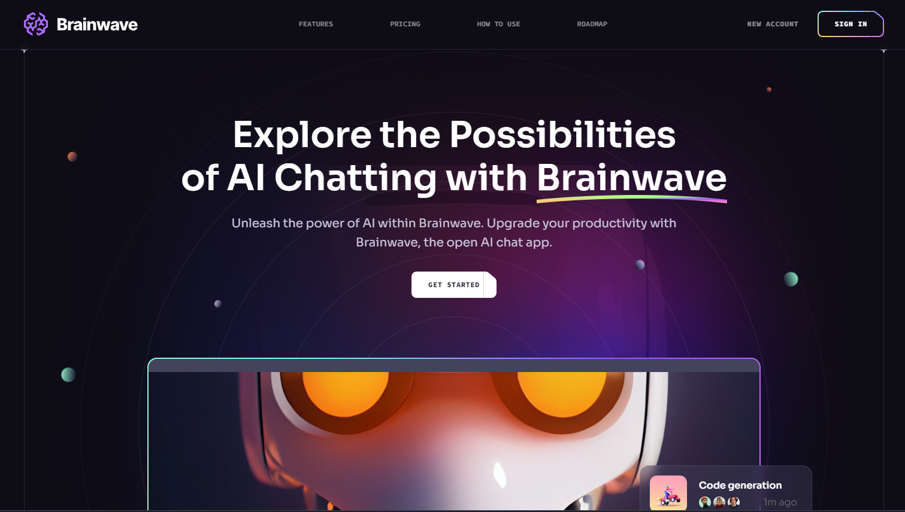

# Modern UI/UX website using ReactJS & TailwindCSS

[Live Site](https://game-hub-nu-lake.vercel.app)

This is a modern UI/UX website, built using React, JavaScript, TailwindCSS smooth animations and responsive interface.

## Technologies

React, Javascript, TailwindCSS, react-just-parallax

## ## Run Locally

To run this project locally, follow these steps:

1. Clone this repository to your local machine.
2. Run `npm install` to install the required dependencies.
3. Run `npm run dev` to start the web server.

## Lessons Learned

First, when I started this project, I wasn't really sure if I could handle the customized Tailwind CSS classes. But I'm happy that I went with it because now I have a better understanding of Tailwind and how to better structure a website, and I learned a lot in this process.
